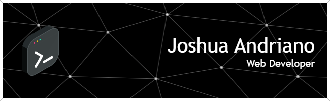

### Hello Ladies and Gentleman! This is your Captain Speaking I'm Joshua Andriano👋

Selamat datang di profile saya! Meskipun saya memulai dengan sapaan seorang kapten, di darat saya lebih dikenal sebagai seorang yang antusias dengan dunia web development, desain UI/UX, Formula 1, dan Sim Racing.

  

---

### 👨‍💻 About Me

Saya adalah seorang pemula yang bersemangat dalam menjelajahi dunia pengembangan web. Saat ini, fokus utama saya adalah membangun fondasi yang kuat di **React** dan **Next.js**. Saya juga sedang dalam perjalanan untuk memahami **Python** yang akan saya gunakan untuk data engineering dan machine learning di masa depan.

Ketertarikan saya sangat besar pada penciptaan pengalaman pengguna yang menarik dan intuitif, itulah mengapa saya juga tertarik dengan bidang **UI/UX design**.

---

### 🚀 What I'm Learning

  
  
  
  

---

### 🤝 Open for Collaboration

Saya sangat terbuka untuk berkolaborasi dalam proyek-proyek menarik, terutama yang berkaitan dengan web development dan UI/UX. Jika Anda memiliki ide atau proyek yang membutuhkan kontribusi, jangan ragu untuk menghubungi saya!

---

### 🏎️ Beyond the Code

Di luar dunia coding, saya adalah penggemar berat **Formula 1** dan dengan bangga mendukung tim **Mercedes-AMG Petronas F1 Team**. Saya juga menikmati sensasi balap melalui **Sim Racing**, yang menurut saya memiliki banyak kesamaan dengan proses pengembangan: membutuhkan fokus, strategi, dan eksekusi yang presisi!

---

### 💬 Let's Connect

  
  
  

